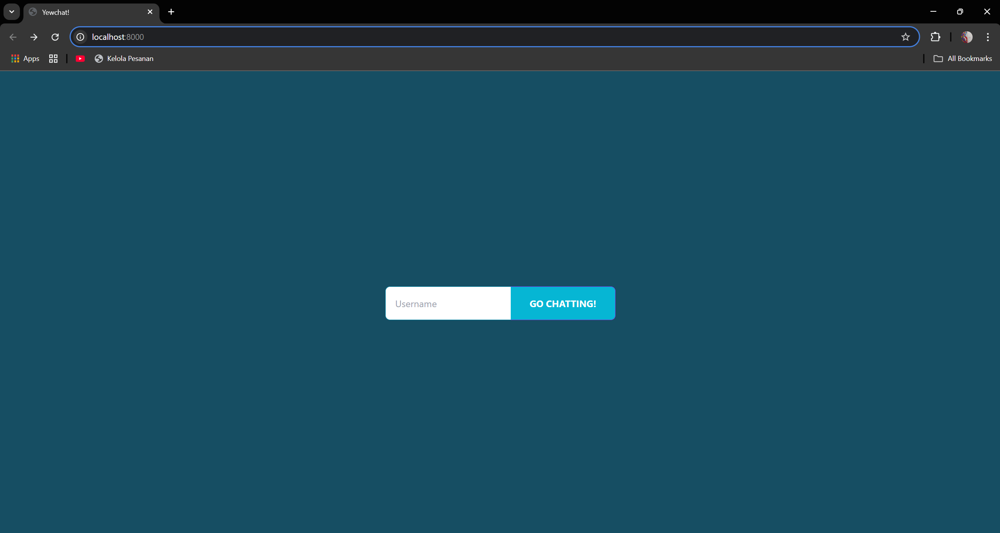
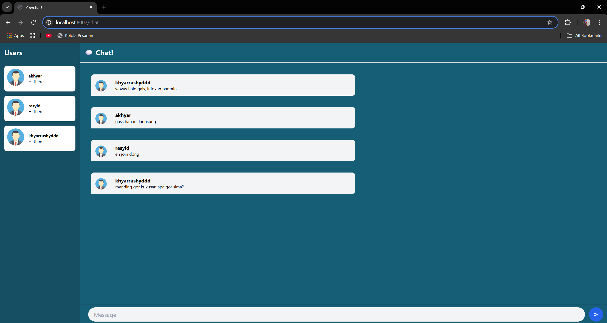

Advance Programming
# Module 10 - Asynchronous Programming (WebChat) 📘

- Nama    : Akhyar Rasyid Asy syifa
- Kelas   : Advance Programming - A
- NPM     : 2306241682

## Reflection
### Experiment 3.1: Original code

gambar tersebut adalah pengimplementasian WebChat original code dari blog https://blog.devgenius.io/lets-build-a-websockets-project-with-rust-and-yew-0-19-60720367399f

### Experiment 3.2: Be Creative!
Disini saya mencoba mengubah theme aplikasi dengan color pallete cyan, mengkreasikan sedikit avatar pengguna, mengubah warna pada beberapa text (nama user, pesan yang dikirimkan), dan juga melalukan modifikasi beberapa text menjadi bold (User, Chat, dan username). Berikut ini tampilan aplikasi setelah saya modifikasi:

#### Login page

#### Chat page
