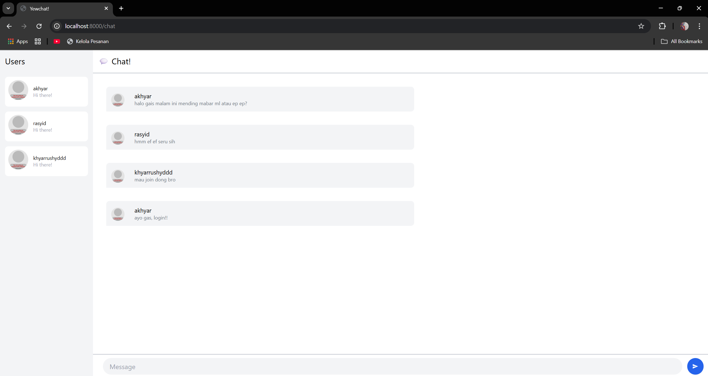

Advance Programming
# Module 10 - Asynchronous Programming (WebChat) 📘

- Nama    : Akhyar Rasyid Asy syifa
- Kelas   : Advance Programming - A
- NPM     : 2306241682

## Reflection
### Experiment 3.1: Original code

gambar tersebut adalah pengimplementasian WebChat original code dari blog https://blog.devgenius.io/lets-build-a-websockets-project-with-rust-and-yew-0-19-60720367399f